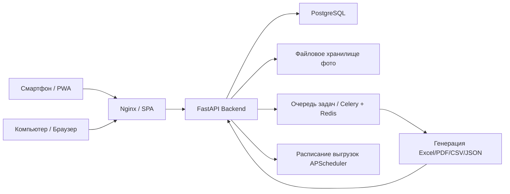

# План реализации: Система учёта имущества школы (PWA + Инвентаризация)

## 1. Общие сведения

**Назначение:** Система строгого учёта имущества школы для муниципалитета с поддержкой
инвентаризации со смартфона (PWA), отчётами и выгрузками в Excel/CSV/JSON, аудитом,
ролями и журналом действий.

**Стек:**
- **Бэкенд:** Python 3.12, FastAPI, SQLAlchemy 2.0 (async), Alembic (миграции), Pydantic v2
- **БД:** PostgreSQL 16
- **Фронтенд:** Vue 3 (Composition API) + Vite + TypeScript + Pinia + Vue Router (SPA)
- **PWA:** Workbox / Vite PWA plugin (service worker, офлайн-кеш, манифест, иконки)
- **UI-библиотека:** Quasar или Vuetify (адаптивность под телефон и ПК)
- **Отчёты/выгрузки:** pandas + openpyxl (Excel со стилями), reportlab (PDF), стандартные CSV/JSON
- **Авторизация:** JWT (access + refresh), OAuth2 password flow, ролевая модель RBAC
- **Фото:** загрузка на бэкенд, хранение файлов на диске/объектном хранилище (начально — локально)
- **Инфраструктура:** Docker + docker-compose (Postgres, backend, frontend, nginx)

**Масштаб старта:** одно учреждение, несколько зданий, ~300 кабинетов, до нескольких
тысяч единиц имущества. Работа с телефона (упрощённый интерфейс) и с компьютера.

---

## 2. Архитектура

### 2.1. Общая схема



### 2.2. Иерархия помещений

```
Учреждение (школа)
   └── Здание (корпус)
          └── Кабинет/Помещение (≈300)
                 └── Единица имущества (карточка)
```

### 2.3. Модули приложения (бэкенд)

| Модуль | Ответственность |
|--------|-----------------|
| `auth` | Регистрация/вход, JWT, refresh-токены, смена пароля |
| `users` | Пользователи, роли, делегирование полномочий |
| `reference` | Справочники: типы объектов, состояния, единицы измерения, материалы |
| `structure` | Здания, кабинеты, подразделения |
| `assets` | Карточки имущества, инвентарные номера, резервирование |
| `operations` | Поступление, перемещение, списание, ремонт, выдача/возврат |
| `inventory` | Инвентаризация (плановая/внеплановая/выборочная), описи, расхождения |
| `documents` | Акт приёма-передачи, акт списания, приложения, фото |
| `audit` | Журнал действий, хранение истории, статусы «черновик→согласование→утверждено» |
| `reports` | Отчёты, генерация Excel/PDF/CSV/JSON, расписание выгрузок |
| `attachments` | Хранение/обработка фото и файлов |

---

## 3. Модель данных (структура БД)

### 3.1. Ключевые таблицы

- **users** — id, login, ФИО, должность, хэш пароля, активен
- **roles** — id, код (ADMIN, ZAVHOZ, DIRECTOR, MUNICIPALITY, INSPECTOR), название
- **user_roles** — связь пользователь ↔ роль (много-много)
- **permissions** — id, код действия (create_card, approve_writeoff, view_reports, ...)
- **role_permissions** — матрица «роль—действие»
- **delegations** — временное делегирование полномочий (от кого, кому, на срок)
- **buildings** — id, название, адрес, корпус
- **rooms** — id, building_id, номер/название, тип (кабинет/склад/столовая/спортзал), подразделение
- **asset_types** — справочник типов объектов (оборудование, мебель, спорт, лаб, иное)
- **asset_attributes** — настраиваемые атрибуты по типу (шаблон карточки)
- **assets** — основная карточка:
  - инвентарный номер (уникальный, по правилам нумерации)
  - тип, модель/марка, серийный номер
  - год приобретения, дата ввода
  - состояние, гарантийный срок
  - комната (место хранения)
  - кол-во, единица измерения, материал
  - стоимость, дата списания, статус
  - фото (при постановке и при инвентаризации)
- **asset_number_reservations** — резервирование инвентарных номеров
- **asset_moves** — перемещения (из комнаты, в комнату, причина, кто оформил)
- **write_offs** — списания (комиссия, документы, согласование, причина)
- **repairs** — ремонт/обслуживание (подрядчик, гарантия, акт, сроки, стоимость)
- **issuances** — выдача/возврат (для уроков/мероприятий, сроки, ответственный, состояние при возврате)
- **inventories** — инвентаризация (тип, период, охват, статус, комиссия)
- **inventory_items** — позиции описи (факт, учёт, расхождение, фото)
- **inventory_discrepancies** — реестр расхождений (недостача/излишек, статус расследования)
- **documents** — акты и приложения (тип, ссылка на файл, подписи, статус согласования)
- **audit_log** — журнал (кто, когда, действие, сущность, поле, старое/новое значение, IP, комментарий)
- **report_jobs** — очередь задач генерации отчётов (статус, формат, результат, уведомление)

### 3.2. Статусная модель документа

`ЧЕРНОВИК → НА_СОГЛАСОВАНИИ → УТВЕРЖДЕНО` с фиксацией времени и пользователя.
После «УТВЕРЖДЕНО» — запрет редактирования/удаления.

### 3.3. Аудит

Каждое изменение фиксируется в `audit_log`. История хранится не менее 5 лет
(архивация/выгрузка истории). Доступ к журналу: директор, администратор, проверяющие
(фильтры по объекту/пользователю/дате).

### 3.4. Правила нумерации

Настраиваемый шаблон, например `{Год}-{Тип}-{№}`. Поддержка авто/ручного присвоения
и резервирования номеров через `asset_number_reservations`.

---

## 4. Роли и права

| Роль | Полномочия |
|------|-----------|
| **Завхоз / МОЛ** | создание/редактирование карточек, перемещения, списания, инвентаризация, выгрузка отчётов |
| **Директор / зам. директора** | утверждение списаний и крупных перемещений, сводные отчёты, аудит |
| **Муниципалитет / проверяющий** | только просмотр, отчёты, история изменений, выгрузка данных |
| **Администратор** | пользователи, роли, справочники, нумерация, шаблоны отчётов |

Реализация: RBAC через `permissions` + `role_permissions`. Делегирование — таблица
`delegations` (временное замещение с контролем срока).

---

## 5. API (основные эндпоинты)

- `POST /auth/login`, `POST /auth/refresh`, `POST /auth/change-password`
- `GET/POST /reference/asset-types`, `/reference/statuses`
- `GET/POST /buildings`, `/rooms`
- `GET/POST/PATCH /assets`, `POST /assets/{id}/photo`, `POST /assets/reserve-number`
- `POST /assets/{id}/move`, `/write-off`, `/repair`, `/issue`, `/return`
- `POST /inventories`, `/inventories/{id}/start`, `/inventories/{id}/items`,
  `/inventories/{id}/discrepancies`, `/inventories/{id}/approve`
- `GET/POST /documents`, `POST /documents/{id}/upload`
- `GET /audit-log` (с фильтрами)
- `GET/POST /reports`, `POST /reports/{id}/run`, `GET /reports/{id}/download`
  (Excel/PDF/CSV/JSON)

---

## 6. PWA и мобильный интерфейс

- Манифест, service worker (офлайн-кеш статики), иконки, установка на главный экран
- Упрощённый адаптивный UI для телефона:
  - быстрый поиск по инвентарному номеру / QR / штрих-коду (план: сканер через камеру)
  - режим инвентаризации: «отсканировал → отметил факт → фото → следующий»
  - фотофиксация через камеру с разрешением
- Полнофункциональный интерфейс для ПК (таблицы, фильтры, массовые операции)

---

## 7. Отчёты и выгрузки

Форматы: **Excel** (листы, стили, условное выделение — красным недостачи),
**PDF**, **CSV**, **JSON**.

Перечень:
- Инвентаризационная опись (поля, подписи, печать, нумерация страниц)
- Ведомость наличия и движения имущества (период, группировка по кабинетам/типам/ответственным)
- Отчёт по износу и остаточной стоимости
- Реестр расхождений по инвентаризации
- Акт списания
- Выгрузки CSV/XML/JSON для централизованной системы (на будущее)

Автоматизация: генерация по кнопке и по расписанию (APScheduler), очередь задач
(`report_jobs`), уведомления о готовности. Внешней системы пока нет — модуль экспорта
закладывается, но активные интеграции не нужны.

---

## 8. Безопасность и соответствие

- HTTPS, CSP-заголовки, корректные Cookie (httpOnly для refresh-токена)
- Хэширование паролей (bcrypt/argon2)
- Защита персональных данных (ФИО ответственных) — доступ по ролям, шифрование при хранении, политика доступа
- Резервное копирование: pg_dump по расписанию, хранение вне сервера, процедура и тестовые восстановления
- Валидация входных данных (Pydantic), ограничение размеров загрузок

---

# Поэтапный план реализации для режима Code

## Этап 0. Инициализация проекта и инфраструктуры
**Цель:** рабочий каркас проекта, который можно запустить локально.

- [x] Создать структуру монорепозитория:
  - `backend/` (FastAPI)
  - `frontend/` (Vue SPA)
  - `docker-compose.yml`, `.env.example`, `README.md`
- [x] Настроить `docker-compose`: `postgres:16`, `backend`, `frontend`, `nginx`
- [x] Создать базовый FastAPI-проект: `main.py`, `config.py`, `database.py` (async SQLAlchemy), подключение к Postgres
- [x] Настроить Alembic и миграции (`0001_initial`, `0002_create_all_tables`)
- [x] Создать Vue 3 + Vite + TS проект, подключить Pinia, Vue Router, UI-библиотеку (Vuetify)
- [x] Настроить Vite PWA plugin (манифест, иконки, service worker)
- [x] Проверить, что бэкенд и фронт запускаются и общаются через nginx

## Этап 1. Модель данных и справочники
**Цель:** база данных покрывает все сущности из чек-листа.

- [x] Создать SQLAlchemy-модели: users, roles, permissions, role_permissions, delegations
- [x] Создать модели структуры: buildings, rooms
- [x] Создать модели объектов: asset_types, asset_attributes, assets, asset_number_reservations
- [x] Создать модели операций: asset_moves, write_offs, repairs, issuances
- [x] Создать модели инвентаризации: inventories, inventory_items, inventory_discrepancies
- [x] Создать модели документов: documents; аудита: audit_log; отчётов: report_jobs
- [x] Создать Alembic-миграции для всех таблиц, уникальные индексы (инвентарный номер)
- [x] Заполнить базовые справочники и роли/разрешения через `app/seed.py` (инициализация администратора)

## Этап 2. Аутентификация, пользователи и роли (RBAC)
**Цель:** безопасный вход и разграничение прав.

- [x] Реализовать `auth`: регистрация/вход, генерация JWT (access/refresh), refresh-эндпоинт, смена пароля
- [x] Реализовать модели/сериализаторы и CRUD для пользователей, ролей, разрешений
- [x] Внедрить проверку разрешений (зависимость `require_permission`) на уровне роутеров
- [x] Реализовать делегирование полномочий (временное замещение) с контролем срока
- [x] Настроить механизм «черновик → согласование → утверждено» для документов и операций
- [ ] Добавить e2e/юнит-тесты авторизации и прав доступа

## Этап 3. Управление структурой и справочниками
**Цель:** администрирование зданий, кабинетов и справочников.

- [x] API + UI для зданий и кабинетов (CRUD, привязка к подразделениям)
- [x] API + UI для справочников типов объектов и настраиваемых атрибутов (шаблоны карточек)
- [x] CRUD состояний, единиц измерения, материалов
- [ ] Валидация ссылочной целостности (кабинет → здание) на уровне UI/сервисов

## Этап 4. Карточки имущества и постановка на учёт
**Цель:** ведение карточек и присвоение инвентарных номеров.

- [x] Реализовать CRUD карточек `assets` с настраиваемыми атрибутами по типу
- [x] Реализовать правила нумерации и резервирование инвентарных номеров (авто/ручное)
- [x] Загрузка и привязка фото к карточке (при постановке на учёт) — `POST/GET /assets/{id}/photo`
- [x] Поиск и фильтрация по номеру, типу, кабинету, состоянию, серийному номеру
- [ ] Реализовать операцию «Поступление» с документами-основаниями (договор, накладная, акт)
- [x] UI: карточка (ПК — полная форма; телефон — упрощённая)

## Этап 5. Операции с имуществом
**Цель:** перемещения, списания, ремонт, выдача/возврат.

- [x] Перемещение: API + UI, фиксация причины, акт при необходимости, история перемещений
- [x] Списание: комиссионный порядок, перечень документов, согласование с директором/муниципалитетом, статусы
- [x] Ремонт/обслуживание: подрядчик, гарантийные работы, акты, сроки, стоимость
- [x] Выдача/возврат: временные выдачи, сроки, ответственные, состояние при возврате
- [x] Журналирование всех операций в `audit_log`

## Этап 6. Инвентаризация (мобильный сценарий)
**Цель:** проведение инвентаризации со смартфона.

- [x] Создание инвентаризации (тип, период, охват: полная/по подразделениям)
- [x] Генерация описи (PDF/Excel) для печати
- [ ] Мобильный режим: список позиций, сканирование QR/штрих-кода, отметка факта, фотофиксация
- [x] Внесение фактического состояния, подсчёт расхождений (недостачи/излишки)
- [ ] Реестр расхождений, статусы расследования, приложение актов/объяснительных
- [x] Утверждение результатов, блокировка редактирования после утверждения
- [x] Поддержка ручного ввода (вне сканера)

## Этап 7. Документы, фото и файлы
**Цель:** хранение и подписание документов.

- [x] Модель `documents` с типами, подписями, статусами согласования
- [x] Загрузка/выгрузка файлов и фото, ограничения размера и типов (`POST/GET /documents/{id}/upload|download`)
- [x] Привязка документов к операциям (поступление, списание, инвентаризация)
- [ ] Просмотр истории версий документов

## Этап 8. Аудит и контроль целостности
**Цель:** журнал действий и защита от несанкционированных изменений.

- [x] Реализовать запись в `audit_log` при любых изменениях (кто, когда, поля, старое/новое, IP, комментарий)
- [x] Аудит авторизации (вход, смена пароля)
- [x] API и UI журнала с фильтрами по объекту/пользователю/дате, правами (директор, администратор, проверяющий)
- [x] Блокировка редактирования/удаления после утверждения акта/инвентаризации
- [ ] Экспорт истории, архивация старше 5 лет

## Этап 9. Отчёты и выгрузки (pandas/Excel/PDF/CSV/JSON)
**Цель:** отчёты для внутреннего контроля и муниципалитета.

- [x] Настроить генерацию Excel через openpyxl (листы, стили заголовков) — условное выделение (красным недостачи) пока не сделано
- [x] Отчёт «Инвентаризационная опись» (Excel/PDF, подписи, нумерация страниц)
- [x] Отчёт «Ведомость наличия и движения имущества» (период, группировка, остатки/поступления/списания)
- [ ] Отчёт «Износ и остаточная стоимость»
- [x] Отчёт «Реестр расхождений»
- [x] Акт списания (PDF)
- [x] Выгрузки CSV/JSON по кнопке — XML отсутствует
- [ ] Очередь задач генерации (`report_jobs`) — сейчас генерация синхронная; расписание (APScheduler) не реализовано
- [ ] Уведомления о готовности отчётов

## Этап 10. PWA-доработки и адаптивность
**Цель:** полноценная работа с телефона.

- [x] Манифест, иконки, установка на главный экран
- [x] Офлайн-кеширование статики (service worker)
- [ ] Упрощённый мобильный интерфейс для ключевых сценариев (инвентаризация, поиск, фото)
- [ ] Проверка на Android/iOS и минимальных версиях браузеров
- [ ] Оптимизация производительности мобильного интерфейса

## Этап 11. Безопасность, бэкапы, деплой
**Цель:** надёжность, соответствие требованиям, развёртывание.

- [x] HTTPS, CSP, настройка Cookie и заголовков безопасности (`SecurityHeadersMiddleware`, HttpOnly-кука, HSTS, образец `nginx.https.conf`)
- [x] Валидация входных данных, защита от загрузки вредоносных файлов (upload реализован: whitelist типов, лимит размера, magic-bytes)
- [x] Политика хранения паролей (bcrypt), смена пароля, JWT (access/refresh)
- [x] Резервное копирование (pg_dump по расписанию) — сервис `backup`, `scripts/backup.sh`/`restore.sh`, процедура и тестовые восстановления в `docs/operations.md`
- [x] Docker-сборка для продакшена, конфигурация через `.env` (доводка: префикс `/api`, `.env.example`, HTTPS-образец)
- [x] Логирование ошибок, мониторинг, алерты (структурированные логи, RequestLoggingMiddleware, глобальный обработчик, `/health`)

## Этап 12. Тестирование, документация и приёмка
**Цель:** проверка системы по чек-листу.

- [x] Юнит-тесты (безопасность, нумерация, хранилище, права доступа) — `tests/test_security.py`, `test_numbering.py`, `test_storage.py`, `test_rbac.py`
- [x] Интеграционные тесты API (auth + сценарий поступление→учёт→перемещение→инвентаризация→списание) — `tests/test_auth_api.py`, `test_inventory_scenario.py`
- [x] Тесты генерации отчётов (Excel/PDF/CSV/JSON) — `tests/test_reports.py`
- [x] Пользовательская документация (роли, инструкции для смартфона и ПК) — `docs/user-guide.md`
- [ ] Сквозная проверка по чек-листу `chek list.md` (требует запущенного стенда с PostgreSQL)
- [ ] Финальная приёмка и передача

---

## 9. Диаграмма этапов


---

## 10. Примечания и рекомендации

- Порядок этапов выстроен по зависимостям: сначала данные, затем авторизация, затем
  бизнес-логика, затем отчёты и мобильность.
- Этапы 3–5 могут разрабатываться параллельно после завершения Этапа 2.
- Для телефона приоритет — Этап 6 (инвентаризация) и Этап 10 (PWA).
- Модуль экспорта во внешнюю систему закладывается на Этапе 9, но активные интеграции
  отложены до появления внешней системы.

---

## 11. Статус реализации (актуально)

Сводка готовности по чек-листам этапов (на основе текущего состояния кодовой базы).

| Этап | Название | Статус |
|------|----------|--------|
| 0 | Инициализация проекта и инфраструктуры | ✅ Готово |
| 1 | Модель данных и справочники | ✅ Готово |
| 2 | Аутентификация, пользователи и роли (RBAC) | 🟡 Почти готово (нет тестов) |
| 3 | Управление структурой и справочниками | 🟡 Почти готово (нужна валидация ссылок) |
| 4 | Карточки имущества и постановка на учёт | 🟡 Частично (нет upload фото, «Поступления») |
| 5 | Операции с имуществом | ✅ Готово (API) |
| 6 | Инвентаризация (мобильный сценарий) | 🟡 Частично (нет сканера QR/штрих-кода) |
| 7 | Документы, фото и файлы | 🟡 Частично (нет upload файлов, истории версий) |
| 8 | Аудит и контроль целостности | 🟡 Почти готово (нет экспорта/архивации) |
| 9 | Отчёты и выгрузки | 🟡 Частично (нет износа, очереди, расписания) |
| 10 | PWA-доработки и адаптивность | 🟡 Частично (база PWA есть) |
| 11 | Безопасность, бэкапы, деплой | ✅ Готово |
| 12 | Тестирование, документация и приёмка | 🟡 В работе (тесты и руководство готовы; остались сквозная проверка на стенде и приёмка) |

### Что уже реализовано

- **Бэкенд FastAPI + async SQLAlchemy + Alembic** — полный набор моделей
  (`auth`, `structure`, `reference`, `asset`, `operation`, `inventory`,
  `document`, `audit`, `report`), роутеры под все основные сущности,
  RBAC через `require_permission`, делегирование полномочий, `write_audit`.
- **Карточки имущества** — авто/ручная нумерация, резервирование номеров,
  поиск/фильтрация, CRUD.
- **Операции** — перемещение, списание, ремонт, выдача/возврат.
- **Инвентаризация** — создание, старт (автогенерация описи), отметка факта,
  завершение (автоподсчёт расхождений), утверждение.
- **Документы** — нумерация, статусы «черновик → согласование → утверждено», подпись.
- **Аудит** — журнал действий с фильтрами и эндпоинтом проверки целостности.
- **Отчёты** — Excel/CSV/JSON/PDF: опись, ведомость, реестр расхождений, акт списания.
- **Фронтенд Vue 3 + Vuetify + Pinia + Router + PWA** — экраны: дашборд, имущество,
  детальная карточка, помещения, инвентаризация, отчёты, пользователи, аудит, вход.
  Service worker, манифест и иконки настроены.
- **Загрузка файлов (Этап 4/7)** — сервис `storage` (валидация типа/размера, защита от
  path traversal, magic-bytes), upload фото карточки `POST /assets/{id}/photo`, файла
  документа `POST /documents/{id}/upload`, выгрузка `GET .../photo|download`. Nginx
  (`client_max_body_size 20m`) и том `uploads` в compose согласованы.
- **Безопасность и деплой (Этап 11)** — заголовки безопасности/CSP, HSTS,
  HttpOnly-кука refresh-токена, TrustedHost, структурированное логирование,
  глобальный обработчик ошибок; авто-бэкапы БД по расписанию (`backup`,
  `scripts/backup.sh|restore.sh`); образец HTTPS (`nginx/nginx.https.conf`),
  срезка префикса `/api` в nginx; документация `docs/operations.md`.

### Приоритетные следующие шаги (по убыванию важности)

1. **Тесты (Этап 12)** — ✅ написан набор юнит- и интеграционных тестов
   (auth, RBAC, нумерация, хранилище, полный сценарий поступление→учёт→перемещение→
   инвентаризация→списание, отчёты). Требуется прогнать на стенде с PostgreSQL.
2. ~~Загрузка файлов и фото (Этап 4/7)~~ — ✅ реализовано: сервис `storage`,
   upload/выгрузка фото карточек и файлов документов, лимиты размера/типов.
3. **Сканер QR/штрих-кода в инвентаризации (Этап 6)** — мобильный сценарий
   «отсканировал → отметил факт → фото → следующий».
4. **Очередь отчётов и расписание (Этап 9)** — вынос синхронной генерации в фоновую
   очередь (`report_jobs`), подключение APScheduler для автоматических выгрузок.
5. **Недостающие отчёты (Этап 9)** — «Износ и остаточная стоимость», условное
   выделение красным недостач в Excel, экспорт XML.
6. **Экспорт/архивация аудита (Этап 8)** — выгрузка журнала, процедура архивации.
7. ~~Безопасность и деплой (Этап 11)~~ — ✅ реализовано: HTTPS/CSP/заголовки,
   HttpOnly-кука, защита upload (magic-bytes), авто-бэкапы pg_dump по расписанию,
   доводка продакшен-Docker (`/api`), логирование/мониторинг.
8. **Пользовательская документация (Этап 12)** — инструкции для ПК и смартфона по ролям.